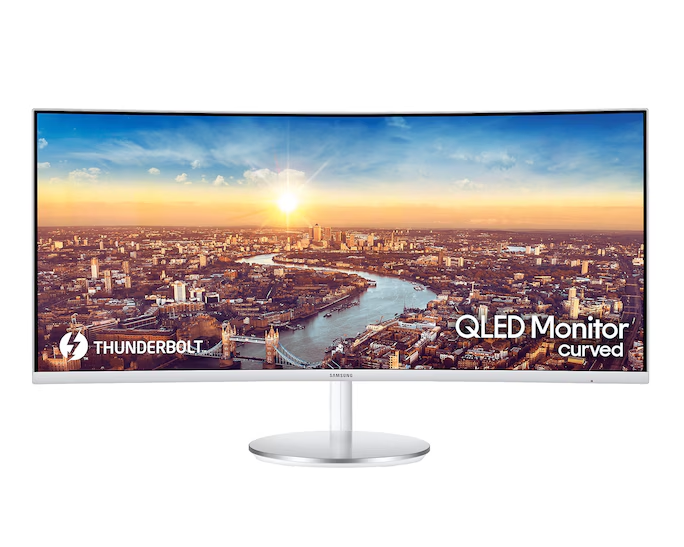
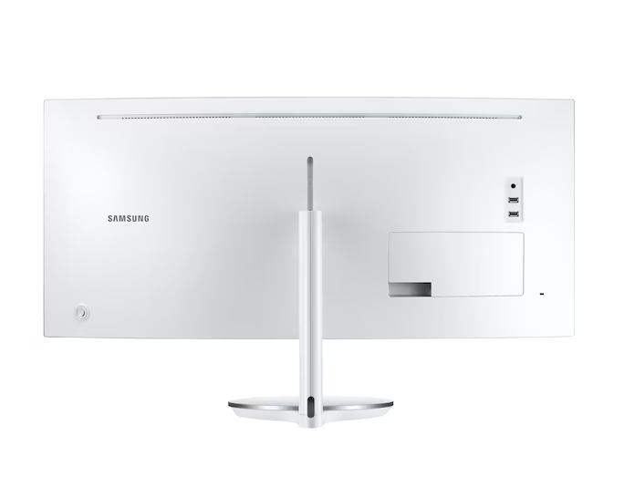

# samsung-jog-api

`samsung-jog-api` is a hardware-and-software project to make a Samsung `CJ791` monitor locally programmable by electrically emulating its front-panel `JOG` control, exposing that behavior through a local REST API, and hosting a touch-first local control interface on a Raspberry Pi-based control deck.

This repository is organized around the Samsung `LC34J791WTNXZA / CJ791` hardware in my setup. Related Samsung monitors with a similar multi-jog front-panel board may be adaptable, but the measurements and assumptions here are specific to this unit unless noted otherwise.

## Monitor photo

  
  

## Status

Current state of the repository:

- completed: `Phase 0: Documentation and Evidence Capture`
- completed: `Phase 1: Host Preparation and Conservative OS Cleanup`
- completed: `Phase 2: Hardware Validation`
- completed: `Phase 3: Bus Observation Circuit Design`
- completed: `Phase 4: Analog Drive Circuit Design` (design docs, KiCad schematic/PCB, BOM, and concept schematic)
- completed: `Phase 5: HDMI and DDC Communication Design`
- completed: `Phase 6: Discrete-Component Protoboard Validation`
- completed: `Phase 8: GPIO Assignment and Low-Level Control Prototype` — [execution record](docs/implementation/phase-8-execution.md)
- completed: `Phase 9: Local Platform Bring-Up` — [execution record](docs/implementation/phase-9-execution.md), [runbook](docs/runbooks/phase-9-platform-bring-up.md) (`systemd` unit `config/systemd/pi-deck.service`, kiosk scripts under `scripts/kiosk/`)
- completed: `Phase 10: Local API` — [execution record](docs/implementation/phase-10-execution.md) (REST `/api/v1`, WebSocket `/ws/events`)
- completed: `Phase 11: Low-Level JOG Console UI` — [execution record](docs/implementation/phase-11-execution.md) (React JOG console in [`frontend/`](frontend/))
- current phase: `Phase 12: Recording and Replay Subsystem` (see [Implementation Plan](docs/implementation/plan.md))
- in parallel: `Phase 7: Integrated Controller Board Design` (KiCad / layout in progress)
- repository now includes Phase 1 runbooks and host-preparation scripts
- repository now includes a Phase 2 execution record for hardware validation
- repository now includes a Phase 3 execution record for bus-observation hardware design
- repository now includes a Phase 4 execution record, KiCad design files, and analog-drive BOM artifacts
- repository now includes completed Phase 5 transport design documentation and execution record
- repository now includes completed Phase 6 protoboard validation documentation, schematic, BOM, and execution record
- hardware findings for the `JOG` board and DDC behavior
- requirements, design, test strategy, and implementation planning for a Raspberry Pi kiosk-style control deck
- Application code layout: [`backend/`](backend/) (Python package **`pi_deck`**: `api`, `services`, `hardware`, … per [Architecture](docs/architecture.md)), [`frontend/`](frontend/) (React/TypeScript UI; `npm run build` copies assets into `backend/src/pi_deck/static/`); protoboard GPIO helpers live under `backend/src/pi_deck/hardware/`. Bring-up script: `scripts/pi-deck-gpio-probe` (see [runbook](docs/runbooks/gpio-bench-probe.md)) — see [Phase 8 Execution Record](docs/implementation/phase-8-execution.md). Host metrics / Pi baseline: `scripts/pi-deck-host-health.py` (see [Phase 9 execution](docs/implementation/phase-9-execution.md) and [Host health gate](docs/implementation/plan.md#host-health-gate-feature-phases-1019)).

## Why this project exists

The CJ791 is a capable monitor, but it is frustrating to automate cleanly.

- It has multiple useful inputs: `HDMI`, `DisplayPort`, and `Thunderbolt / USB-C`
- It has a rear-mounted `JOG` control that can navigate the on-screen display and trigger functions the normal software control path cannot, but it is inconvenient to use repeatedly
- It exposes DDC/CI, which is enough to read some state and control some functions
- It does not reliably expose the full monitor control surface over DDC alone on this unit

In practice, this project uses a hybrid model:

- `JOG` emulation for actions that need true front-panel behavior
- `DDC/CI` for machine-readable feedback and the functions that already work reliably
- front-panel `LED` observation for local feedback cues such as input-change blink patterns, idle state, and possible OSD boundary signals
- a local Raspberry Pi touch device as the always-on operator-facing control surface

This matters especially for input switching. On this monitor, source selection is effectively a cycle through available inputs rather than a reliable direct jump to a named source, so current-state feedback is what tells the controller when to stop cycling.

## System overview

High-level system shape:

- custom inline controller sits between the original `JOG` board and the monitor main board
- controller reproduces the same resistance-to-ground states the monitor expects on `KEY_ADC1` and `KEY_ADC2`
- controller observes the front-panel `LED` state as an additional feedback signal
- local backend software exposes high-level actions through a REST API
- a local touch UI runs in kiosk mode on a Raspberry Pi and calls the same API
- DDC/CI provides state readback and supported direct controls such as brightness and power

The system is expected to support three operating modes:

- `JOG` mode for raw low-level control, investigation, and recovery
- `DDC` mode, where the controller can read the current input and stop source-cycling or `PIP` navigation at the correct state
- `Blind` mode, where the UI asks the user for current and desired input so the controller can perform blind source cycling from a known starting point

## Documentation index

Project definition:

- [Requirements](docs/requirements.md)
- [Solution Overview](docs/design/solution-overview.md)
- [Implementation Plan](docs/implementation/plan.md)
- [Test Strategy](docs/testing/test-strategy.md)
- [Code Guidelines](docs/development/code-guidelines.md)

Reference and reverse-engineering notes:

- [Architecture](docs/architecture.md)
- [CJ791 JOG Board Notes](docs/hardware/cj791-jog-board.md)
- [Phase 3 Observation BOM](docs/hardware/phase-3-observation-bom.md)
- [CJ791 DDC and VCP Behavior](docs/ddc/cj791-vcp-behavior.md)

Operational docs:

- [Prepare Raspberry Pi](docs/runbooks/prepare-raspberry-pi.md)
- [Phase 9: Local platform bring-up](docs/runbooks/phase-9-platform-bring-up.md)
- [GPIO bench probe (protoboard)](docs/runbooks/gpio-bench-probe.md) — GPIO/I²C bring-up script on the Pi
- [Phase 2 Execution Record](docs/implementation/phase-2-execution.md)
- [Phase 3 Execution Record](docs/implementation/phase-3-execution.md)
- [Phase 4 Execution Record](docs/implementation/phase-4-execution.md)
- [Phase 5 Execution Record](docs/implementation/phase-5-execution.md)
- [Phase 6 Execution Record](docs/implementation/phase-6-execution.md)
- [Phase 8 Execution Record](docs/implementation/phase-8-execution.md)

## Start here

Recommended reading order:

1. [README.md](README.md)
2. [Requirements](docs/requirements.md)
3. [Solution Overview](docs/design/solution-overview.md)
4. [CJ791 JOG Board Notes](docs/hardware/cj791-jog-board.md)
5. [CJ791 DDC and VCP Behavior](docs/ddc/cj791-vcp-behavior.md)
6. [Implementation Plan](docs/implementation/plan.md)

## Safety and scope

This project intentionally modifies monitor hardware and is not warranty-safe.

- opening the monitor can damage clips, cables, or boards
- cutting or extending the `JOG` harness can permanently alter the monitor
- mistakes on the key lines can damage the monitor input circuitry
- nothing here should be treated as stock-safe or supportable by the manufacturer

The goal is not to preserve stock condition. The goal is to create a practical, local, programmable control interface for a monitor whose original user interface is difficult to automate cleanly.
