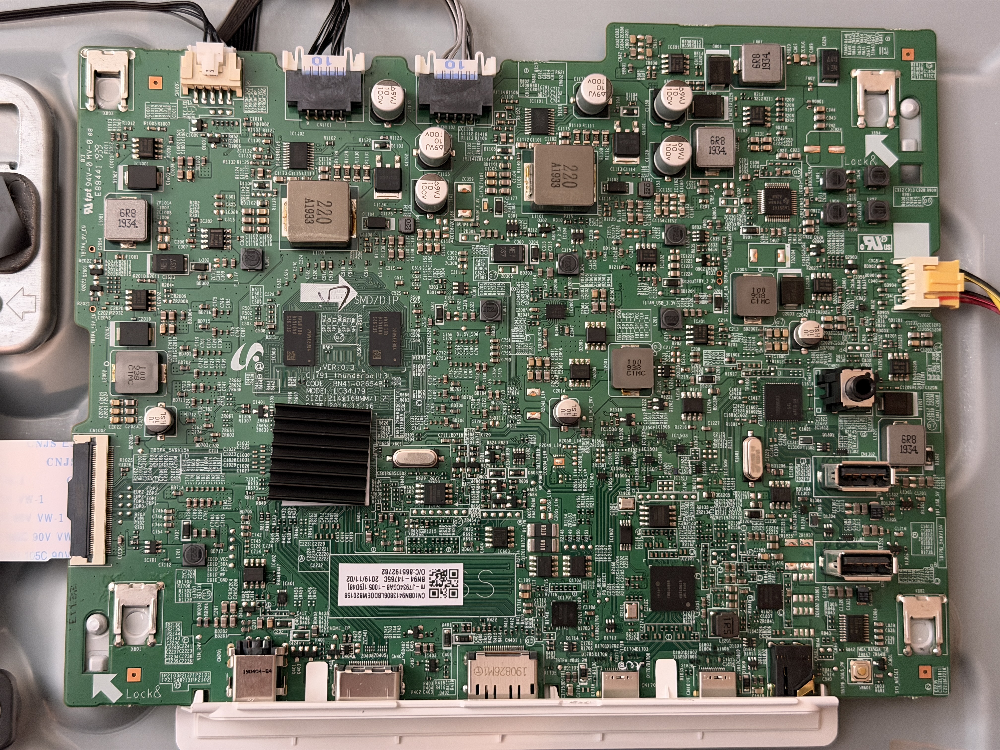
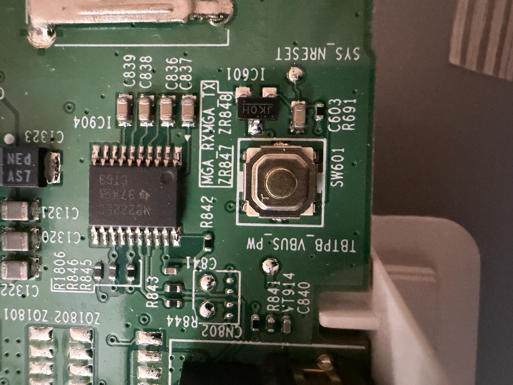
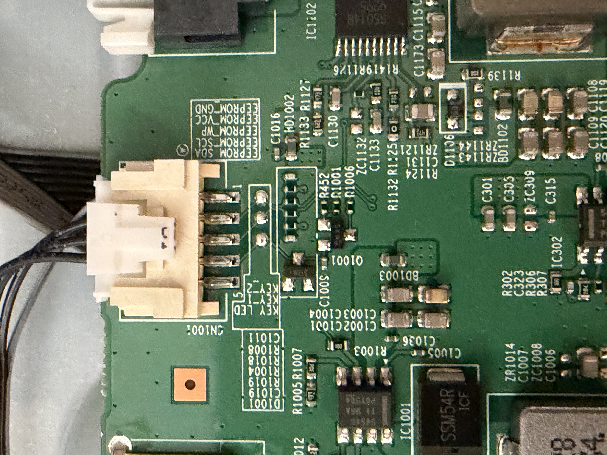
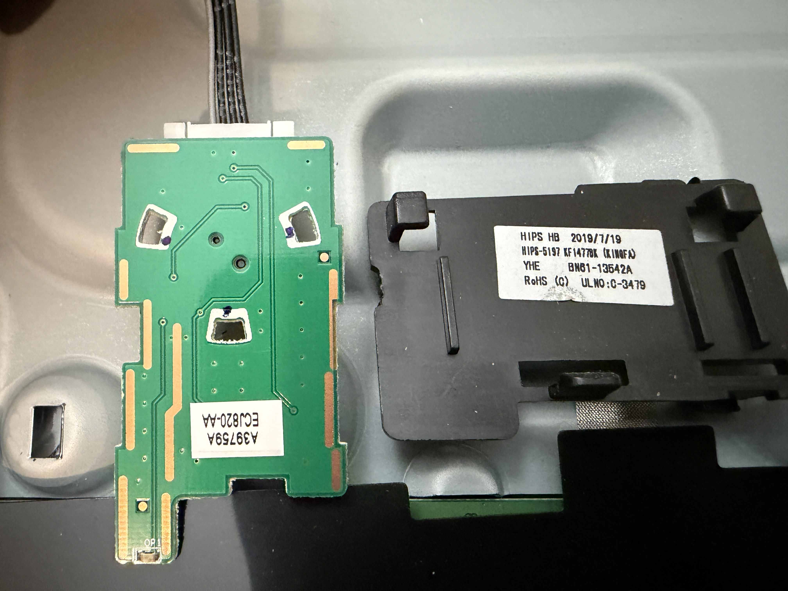

# CJ791 JOG Board Notes

## Scope

This document records the current hardware observations for the Samsung `LC34J791WTNXZA / CJ791` front-panel `JOG` control path.

## Monitor information

Target monitor:

- model: `Samsung LC34J791WTNXZA`
- marketing name: `Samsung CJ791`
- panel size: `34-inch ultrawide curved`
- resolution: `3440x1440`
- inputs: `HDMI`, `DisplayPort`, `Thunderbolt 3 / USB-C`
- features: `Picture-in-Picture`, `Picture-by-Picture`, built-in OSD, rear-mounted `JOG` control

## JOG hardware

Samsung refers to the rear control as the `JOG` button. On this monitor the rear control board appears to behave like a passive input board connected back to the main board.

## Reference photos

These photos are the current visual reference set for `Phase 2` hardware validation.

<table>
  <tr>
    <td align="center" width="50%">
      
       
      <strong>Main board context</strong>
       
      Overall view of the main board and the area where the `JOG` harness lands.
    </td>
    <td align="center" width="50%">
      
       
      <strong>Connector close-up</strong>
       
      Closer view of the pushbutton and connector area used to confirm orientation and nearby labeling.
    </td>
  </tr>
  <tr>
    <td align="center" width="50%">
      
       
      <strong>Joystick board connection</strong>
       
      Harness and board-side connection view used to correlate cable routing and pin order.
    </td>
    <td align="center" width="50%">
      
       
      <strong>Joystick board rear side</strong>
       
      Rear view of the `JOG` board for component and trace inspection.
    </td>
  </tr>
</table>

Original asset links:

- [cj791-mainboard-full.jpg](/Users/raffcorreia/dev/src/raffcorreia/samsung-jog-api/docs/assets/hardware/cj791-mainboard-full.jpg)
- [cj791-pushbutton-close.jpg](/Users/raffcorreia/dev/src/raffcorreia/samsung-jog-api/docs/assets/hardware/cj791-pushbutton-close.jpg)
- [cj791-joystick-board-connection.jpg](/Users/raffcorreia/dev/src/raffcorreia/samsung-jog-api/docs/assets/hardware/cj791-joystick-board-connection.jpg)
- [cj791-joystick-back.jpg](/Users/raffcorreia/dev/src/raffcorreia/samsung-jog-api/docs/assets/hardware/cj791-joystick-back.jpg)

The relevant connector is documented as `CN1001` on the monitor main board with this pinout:

- pin 1: `GND`
- pin 2: `KEY_ADC2`
- pin 3: `KEY_ADC1`
- pin 4: `KEY_LED`
- pin 5: `NC`

This pin order was visually reconfirmed on the target unit and is supported by the current photo set in this repo.

This matters because it suggests the `JOG` is not a bank of ordinary digital switch lines. The monitor appears to read button activity through analog key-sense lines.

The `KEY_LED` line is also important. It is not just a cosmetic output if it can be observed reliably by the controller, because front-panel `LED` behavior may provide useful confirmation cues during input changes, idle states, and some OSD workflows.

## Current electrical model

Current working model:

- `KEY_ADC1` and `KEY_ADC2` idle high at about `3.3V` relative to `GND`
- button actions are represented by distinct resistance-to-ground values on those lines
- `KEY_ADC2` carries the four directional actions
- `KEY_ADC1` carries center or enter
- `KEY_LED` is a separate observable signal and should be treated as input-only in the external controller

This is why an inline electrical emulator is attractive. The system does not necessarily need to reverse engineer every internal software path if it can present the same electrical behavior the original `JOG` board presents.

## Idle bus state

Measured idle voltage relative to `GND`:

| Line | Idle voltage |
| --- | --- |
| `KEY_ADC1` | `3.29V` |
| `KEY_ADC2` | `3.29V` |
| `KEY_LED` | `0V` |

Interpretation:

- both key lines appear to be pulled high in idle state
- actions are then likely detected by the monitor as changes toward ground through known resistor values
- `KEY_LED` is low in idle state and rises when the LED is active
- the current monitor setting is `LED off when monitor is on`, which means the steady on-state is not the normal runtime baseline

## Measured input behavior

These measurements were taken with the joystick board disconnected and resistance measured to ground.

### `KEY_ADC2` directional channel

| State | Measurement |
| --- | --- |
| `Idle` | `3.3V` to `GND` |
| `Down` | `3.3 kOhm` to `GND` |
| `Right` | `9 kOhm` to `GND` |
| `Up` | `22.6 Ohm` to `GND` |
| `Left` | `32.8 kOhm` to `GND` |

### `KEY_ADC1` center channel

| State | Measurement |
| --- | --- |
| `Idle` | `3.3V` to `GND` |
| `Center` | `23 Ohm` to `GND` |

## Latest powered key-state measurements

The latest powered and connected measurement set adds the observed bus voltage for each active state.

### `KEY_ADC2` powered behavior

| State | Voltage to `GND` | Resistance to `GND` | Commercially Available |
| --- | --- | --- | --- |
| `Idle` | `3.29V` | | |
| `Left` | `2.88V` | `32.8 kOhm` | `30 kOhm` |
| `Right` | `2.16V` | `9 kOhm` | `10 kOhm` |
| `Up` | `0.01V` | `22.8 Ohm` | `22 Ohm` |
| `Down` | `1.35V` | `3.3 kOhm` | `3.3 kOhm` |

### `KEY_ADC1` powered behavior

| State | Voltage to `GND` | Resistance to `GND` | Commercially Available |
| --- | --- | --- | --- |
| `Idle` | `3.29V` | | |
| `Center` | `0.01V` | `22.71 Ohm` | `22 Ohm` |

## Interpretation

Current interpretation:

- `KEY_ADC2` is a resistor ladder for the four directional actions
- `KEY_ADC1` is a separate analog sense line for center or enter
- the powered measurements show that `KEY_ADC1` center and `KEY_ADC2` up both collapse very close to ground on the target unit
- the powered measurements also show that the directional states are well separated by voltage on `KEY_ADC2`
- the monitor likely decodes button presses by reading analog thresholds on those ADC inputs
- `KEY_LED` is electrically readable and appears usable as a basic controller input
- with the LED connected, the active state was observed around `2.7V`
- with the LED disconnected, the active state was observed around `2.9V`
- the monitor is currently configured so the LED is off while the monitor is on and on while the monitor is off
- the LED also blinks while the monitor is idle, but the blink frequency and semantic meaning still need later characterization

## External controller responsibilities

The external controller board is expected to handle at least these responsibilities:

- observe `KEY_ADC1`
- observe `KEY_ADC2`
- observe `KEY_LED`
- drive `KEY_ADC1` with the required analog behavior
- drive `KEY_ADC2` with the required analog behavior
- preserve use of the original physical `JOG`

The design should explicitly separate:

- observe bus responsibilities
- drive bus responsibilities

even if those paths eventually share board-level circuitry.

## Measurement notes

To keep future measurements comparable, record:

- date
- monitor model and any visible board revision
- meter model
- whether the `JOG` board is connected or disconnected
- probe placement

Current recorded metadata for the latest confirmed voltage and LED readings:

- date: `03/24/2026` for the initial Phase 2 set, plus a later supplemental powered-state set recorded during Phase 3 design review
- meter model: `EEVBlog 121GW`
- board state: connected, powered, and functional
- ambiguity or instability: none observed

Recommended measurement sequence:

1. Identify connector `CN1001` and confirm pin orientation.
2. Confirm `GND`, `KEY_ADC1`, `KEY_ADC2`, and `KEY_LED`.
3. Measure idle voltage to ground for `KEY_ADC1` and `KEY_ADC2`.
4. Measure resistance to ground while actuating each directional `JOG` action.
5. Measure resistance to ground while pressing center.
6. Repeat measurements at least once to check consistency.
7. Record any unstable or ambiguous values.

Suggested key-line evidence table:

| Line | State | Measurement type | Value | Notes |
| --- | --- | --- | --- | --- |
| `KEY_ADC2` | `Idle` | voltage | | |
| `KEY_ADC2` | `Down` | resistance | | |
| `KEY_ADC2` | `Right` | resistance | | |
| `KEY_ADC2` | `Up` | resistance | | |
| `KEY_ADC2` | `Left` | resistance | | |
| `KEY_ADC1` | `Idle` | voltage | | |
| `KEY_ADC1` | `Center` | resistance | | |

Current connected-versus-disconnected observation:

- `KEY_ADC1` and `KEY_ADC2` did not change when the `JOG` board was connected or disconnected
- this held when the `JOG` side and either side of the cable were disconnected

Suggested `LED` evidence table for later phases:

| State | Measurement type | Value | Notes |
| --- | --- | --- | --- |
| idle | voltage or logical level | `0V` | confirmed in Phase 2 |
| active | voltage or logical level | `2.7V` with LED connected | confirmed in Phase 2 |
| active | voltage or logical level | `2.9V` with LED disconnected | confirmed in Phase 2 |
| idle blink | timing pattern | to be measured later | observed in Phase 2, timing deferred |

## Known gaps

- tolerance ranges for each button value are not yet known
- the electrical characteristics and exact semantics of `KEY_LED` still need confirmation
- contention behavior between the original board and an inline controller is not yet fully characterized
- acceptable tolerance around each resistor value is not yet documented

## Suggested follow-up

- repeat all voltage and resistance measurements and record date, tool, and conditions
- capture photos of connector orientation and wiring colors
- record whether measurements differ while the board is connected versus isolated
- confirm only basic `KEY_LED` readability in Phase 2, and defer richer LED pattern investigation until the later dedicated LED phase
- measure idle blink timing and correlate it with repeated workflows only after recording and replay are available
- test whether button recognition is tolerant to nearby resistor substitutions
