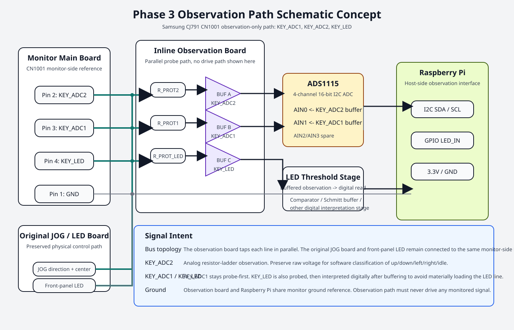

# Phase 3 Execution Record

## Purpose

This document records the actual execution of `Phase 3: Bus Observation Circuit Design`.

It complements:

- [Implementation Plan](/Users/raffcorreia/dev/src/raffcorreia/samsung-jog-api/docs/implementation/plan.md)
- [Solution Overview](/Users/raffcorreia/dev/src/raffcorreia/samsung-jog-api/docs/design/solution-overview.md)
- [CJ791 JOG Board Notes](/Users/raffcorreia/dev/src/raffcorreia/samsung-jog-api/docs/hardware/cj791-jog-board.md)
- [Phase 2 Execution Record](/Users/raffcorreia/dev/src/raffcorreia/samsung-jog-api/docs/implementation/phase-2-execution.md)

## Goal

Produce and approve a hardware design for continuously observing `KEY_ADC1`, `KEY_ADC2`, and `KEY_LED` without disturbing normal monitor behavior or the preserved original `JOG`.

## Reference Diagram

Current observation-path concept diagram:

This diagram is intentionally schematic in the architectural sense, not a finalized electrical schematic. Its purpose is to show that the observation board probes the existing bus in parallel while the original `JOG` board and front-panel LED remain connected.

Preliminary connection-level schematic:

- KiCad project: [phase-3-observation.kicad_pro](/Users/raffcorreia/dev/src/raffcorreia/samsung-jog-api/hardware/kicad/phase-3-observation/phase-3-observation.kicad_pro)
- KiCad schematic: [phase-3-observation.kicad_sch](/Users/raffcorreia/dev/src/raffcorreia/samsung-jog-api/hardware/kicad/phase-3-observation/phase-3-observation.kicad_sch)
- BOM: [phase-3-observation-bom.md](/Users/raffcorreia/dev/src/raffcorreia/samsung-jog-api/docs/hardware/phase-3-observation-bom.md)

This is the current connection-level schematic source for the observation path. It replaces the second SVG-style diagram and is intended to be the editable starting point for the actual electrical design.

## Inputs From Phase 2

The current observation design starts from these validated monitor-side facts:

- connector: `CN1001`
- pin 1: `GND`
- pin 2: `KEY_ADC2`
- pin 3: `KEY_ADC1`
- pin 4: `KEY_LED`
- pin 5: `NC`
- `KEY_ADC1` idle: `3.3V` to `GND`
- `KEY_ADC2` idle: `3.3V` to `GND`
- powered state set: `KEY_ADC1` idle `3.29V`, center `0.01V`
- powered state set: `KEY_ADC2` idle `3.29V`, `left` `2.88V`, `right` `2.16V`, `down` `1.35V`, `up` `0.01V`
- `KEY_LED` idle: `0V`
- `KEY_LED` active: `2.7V` with the LED connected
- `KEY_LED` active: `2.9V` with the LED disconnected
- `KEY_ADC1` and `KEY_ADC2` action states are represented by resistance-to-ground values
- `KEY_ADC1` and `KEY_ADC2` did not materially change when the `JOG` board or cable side was connected or disconnected

## Design Scope

This phase covers only the observation path.

In scope:

- `KEY_ADC1` observation
- `KEY_ADC2` observation
- `KEY_LED` observation
- monitor-safe electrical interfacing to Raspberry Pi inputs
- software-visible output of the observed signal states

Out of scope:

- analog drive circuitry
- final Raspberry Pi GPIO assignment
- detailed `KEY_LED` semantic interpretation
- sequence recording implementation

## Functional Requirements

The observation path must:

- continuously observe `KEY_ADC1`, `KEY_ADC2`, and `KEY_LED`
- avoid materially changing monitor behavior or original `JOG` behavior
- preserve the original physical `JOG` inline
- expose enough information for bus-busy detection and later recording
- expose `KEY_LED` as a readable signal for later correlation work

## Electrical Requirements

The observation path should:

- present very high input impedance to the monitor-side signals
- never drive `KEY_ADC1`, `KEY_ADC2`, or `KEY_LED`
- safely interface monitor-side voltages to Raspberry Pi-readable inputs
- tolerate the currently observed idle and active voltages
- remain valid even if resistor-tolerance and measurement noise vary slightly around the documented values

## Software-Facing Requirements

The observation path should make it possible for software to derive:

- whether `KEY_ADC1` is idle or active
- whether `KEY_ADC2` is idle or active
- the logical `KEY_ADC2` direction when a valid directional state is present
- the logical `KEY_ADC1` center press when present
- whether `KEY_LED` is low or high after buffered observation
- timestamps or edge events suitable for later recording and arbitration

## Candidate Observation Approaches

### Candidate A: Comparator / Digital-Threshold Observation

Observe each line through protection and thresholding, then expose only digital state changes to the Raspberry Pi.

Pros:

- simpler Raspberry Pi integration
- easier to consume in software
- lower software processing burden

Cons:

- weaker fit for resistor-ladder decoding on `KEY_ADC1` and `KEY_ADC2`
- loses analog visibility that may matter for tolerance investigation
- risks hard-coding thresholds too early

### Candidate B: Buffered Analog Observation

Buffer each observed line with a very high-impedance analog front end and feed the resulting signals into an external ADC or equivalent analog-sensing stage before software decoding.

Pros:

- best fit for resistor-ladder observation on `KEY_ADC1` and `KEY_ADC2`
- preserves analog visibility for threshold and tolerance work
- better foundation for later recording and validation

Cons:

- more component and software complexity
- requires ADC selection and analog reference decisions

### Candidate C: Hybrid Observation

Use buffered analog observation only where it is needed, and buffered high-impedance observation with digital-threshold interpretation where the measured voltage separation makes it practical.

Pros:

- matches the actual signal characteristics better
- keeps `KEY_ADC2` observable as analog state
- allows `KEY_ADC1` and `KEY_LED` to behave more like interrupt-friendly digital inputs after buffering
- reduces dependence on a multiplexed ADC path for multiple signals

Cons:

- mixed implementation paths
- slightly more board complexity than a fully digital approach

## Current Recommendation

The current recommended direction is `Candidate C`.

Rationale:

- `KEY_ADC2` remains a true multi-state analog input and should stay observable as analog during the first hardware implementation
- the latest powered measurements show that `KEY_ADC1` center collapses very close to ground and is strongly separable from idle
- `KEY_LED` already looks suitable for high-or-low observation after a high-impedance probe stage
- this keeps analog complexity only where it is justified and makes `KEY_ADC1` and `KEY_LED` easier to surface as GPIO-level events

## Selected Observation Architecture

The current Phase 3 design decision is to use a hybrid observation path:

- `KEY_ADC1` observed through a high-impedance buffered path and then interpreted digitally
- `KEY_ADC2` observed as analog through a high-impedance buffered path
- `KEY_LED` observed through a buffered high-impedance path and then interpreted digitally

This is now the selected architecture for the next phase, unless later bench testing reveals that the chosen analog front end disturbs the bus or produces unstable readings.

### Selected `KEY_ADC2` observation path

For `KEY_ADC2`, the preferred topology is:

1. monitor-side tap from `CN1001`
2. input protection resistor on each observed line
3. optional small RC filter only if noise proves problematic
4. high-input-impedance rail-to-rail buffer stage
5. external ADC readable by the Raspberry Pi

This keeps the monitor-side loading low, preserves analog visibility, and gives software the raw observations it needs to classify the directional states and later tune thresholds.

### Selected `KEY_ADC1` observation path

For `KEY_ADC1`, the preferred topology is:

1. monitor-side tap from `CN1001`
2. input protection resistor
3. high-input-impedance rail-to-rail buffer stage
4. Schmitt-trigger or equivalent threshold stage
5. Raspberry Pi-readable digital input path

This is now preferred because the latest powered measurements show a large voltage gap between `idle` and `center`, making a digital post-buffer interpretation reasonable for this channel.

### Selected `KEY_LED` observation path

For `KEY_LED`, the preferred topology is:

1. monitor-side tap from `CN1001`
2. input protection resistor
3. high-input-impedance buffer or equivalent probe stage
4. optional clamp or logic-conditioning stage if bench testing shows it is needed
5. Raspberry Pi-readable digital input path

At this stage `KEY_LED` does not need to be treated as a full analog recording channel. The current design goal is to expose low-or-high state transitions safely and reliably without materially loading the LED line.

## Component Direction

Phase 3 now locks both the component direction and the first exact part set for the reviewable observation design.

### `KEY_ADC2` observation component direction

`KEY_ADC2` should be observed with:

- a rail-to-rail high-input-impedance analog buffer stage
- an external ADC
- a Raspberry Pi software path that reads raw ADC values and maps them into logical states

Preferred component classes:

- quad or dual rail-to-rail op-amp suitable for unity-gain buffering at `3.3V`
- external I2C ADC so the Raspberry Pi does not need direct analog input hardware

Why this direction is selected:

- the Raspberry Pi does not provide native analog inputs
- `KEY_ADC2` is fundamentally multi-state analog and should stay observable as analog in the first implementation
- using an external ADC keeps the software model clean while preserving state information

### `KEY_ADC1` component direction

`KEY_ADC1` should be observed with:

- a high-input-impedance buffer stage
- a digital threshold or Schmitt-trigger stage
- a Raspberry Pi GPIO input

Why this direction is selected:

- the latest powered measurements show a strong separation between `idle` and `center`
- `KEY_ADC1` is effectively binary on this monitor
- removing `KEY_ADC1` from the ADC path avoids relying on multiplexed ADC observation for two different key buses

### `KEY_LED` component direction

`KEY_LED` should be observed through a buffered high-impedance path first, then interpreted as a digital signal.

Preferred component classes:

- series input resistor
- high-input-impedance buffer stage or equivalent probe stage
- optional clamp or logic-conditioning stage if needed after bench validation
- Raspberry Pi GPIO input or another digital input presented to the host after buffering

Why this direction is selected:

- the measured `KEY_LED` behavior currently looks compatible with simple on-or-off observation
- direct resistor-only sensing would still draw some current and is not the best fit for the low-interference observation philosophy
- richer LED semantics are intentionally deferred to the later LED characterization phase
- there is no current need to spend analog-channel budget on `KEY_LED`

## Reference Component Shortlist

These reference families capture the reasoning behind the selected parts and remain valid alternates if later bench testing forces a package or sourcing change.

### Analog buffer stage

Target characteristics:

- rail-to-rail input and output
- unity-gain stable
- operates from `3.3V`
- very low input bias current
- available in dual or quad package

Reference examples to evaluate:

- `MCP6002` / `MCP6004`
- similar low-power rail-to-rail op-amps with good behavior near ground and `3.3V`

### External ADC

Target characteristics:

- I2C interface
- at least 1 analog channel
- input range compatible with `0V` to `3.3V`
- enough sample rate for repeated human-driven `JOG` activity and later recording
- optional `ALERT/RDY` support for interrupt-assisted observation

Reference examples to evaluate:

- `ADS1114`
- similar I2C ADCs with adequate resolution and software support

### Digital input path for `KEY_ADC1` and `KEY_LED`

Target characteristics:

- protected Raspberry Pi-readable digital input after a high-impedance probe stage
- simple high-or-low interpretation
- Schmitt-trigger behavior preferred
- optional extra logic conditioning only if later bench tests show it is needed

Reference building blocks to evaluate:

- series input resistor
- op-amp or other high-input-impedance buffer stage
- optional clamp protection
- optional Schmitt-trigger conditioning only if raw GPIO edge quality proves poor

## Proposed Observation Responsibilities

The observation hardware should be responsible for:

- monitor-side input protection
- high-impedance buffering or equivalent isolation
- analog presentation of `KEY_ADC1` and `KEY_ADC2` to software-readable hardware
- high-impedance observation of `KEY_LED` followed by digital presentation to software-readable hardware
- preserving a stable reference to monitor `GND`

Software should remain responsible for:

- mapping observed analog ranges into logical `up`, `down`, `left`, `right`, and `center`
- deciding whether a bus is busy
- exposing events and state to the API and later recording subsystem

## Classification Strategy

The observation path should expose raw values first and classify in software second.

That means:

- the hardware should not try to decide `up`, `down`, `left`, or `center`
- software should map ADC ranges into logical states after real readings are collected
- threshold ranges should be derived from measured values with margin, not guessed in hardware

Expected software-visible states:

- `KEY_ADC1`: `idle`, `center`, `unknown`
- `KEY_ADC2`: `idle`, `up`, `down`, `left`, `right`, `unknown`
- `KEY_LED`: `low`, `high`

## Sampling Expectations

The observation design does not need high-speed instrumentation behavior.

It does need to:

- capture human-driven `JOG` presses and holds reliably
- expose enough temporal detail for later recording and arbitration
- leave room for repeated polling while the UI and backend are active

The practical implication is:

- the ADC path should support steady repeated sampling of both key channels
- software should store raw samples or short-window derived states during early bring-up
- exact sampling rates can remain an implementation detail, but the chosen ADC should not be so slow that short button taps become ambiguous

## Verification Plan

The implemented observation path should be verified in this order:

1. bench-check the observation hardware without the monitor connected
2. verify that the observation path does not drive any monitored line
3. connect the observation path inline with the preserved original `JOG`
4. confirm idle readings for `KEY_ADC1`, `KEY_ADC2`, and `KEY_LED`
5. confirm that physical `JOG` use still behaves normally on the monitor
6. record repeated readings for each directional action and center press
7. confirm that software can classify each logical state consistently
8. confirm that `KEY_LED` high and low transitions are visible without affecting the monitor
9. confirm that the presence of the observation path does not materially change previously validated resistance and voltage behavior

Success criteria:

- the monitor behaves normally with the observation path connected
- the key buses remain readable and classifiable
- the original `JOG` remains usable
- `KEY_LED` state transitions are visible
- no unstable or unexplained loading effects are introduced

## Remaining Design Decisions

Only a narrower set of decisions remains open after the Phase 3 architecture selection:

- whether a small RC filter is needed on the observed key buses
- exact protection values for the observed lines
- whether `KEY_LED` needs extra conditioning beyond a buffered protected digital-input path

## Exact Part Selection

The Phase 3 observation circuit uses these locked parts:

| Ref | Part | Package | LCSC | Notes |
|-----|------|---------|------|-------|
| U1 | TLV9064IDR | SOIC-14 | C388176 | Quad rail-to-rail op-amp, buffers all three lines + spare |
| U2 | ADS1115IDGSR | MSOP-10 | C37593 | 16-bit I2C ADC, pin-compatible substitute for ADS1114IDGST (stock) |
| U3 | 74LVC1G17GW | SC-70-5 | C426705 | Schmitt buffer for KEY_ADC1 |
| U4 | 74LVC1G17GW | SC-70-5 | C426705 | Schmitt buffer for KEY_LED |

Rationale:

- `TLV9064IDR` provides four low-voltage rail-to-rail op-amp channels so the two analog key buses and the LED line can all be buffered while leaving one spare channel
- `ADS1115IDGSR` keeps `KEY_ADC2` observable as an analog signal through a Pi-friendly `I2C` ADC path. Substituted from `ADS1114IDGST` due to low LCSC stock — pin-compatible MSOP-10, same symbol and pinout, AIN1 tied to GND for single-ended measurement
- `74LVC1G17GW` provides a clean digital interpretation stage for buffered `KEY_ADC1` and `KEY_LED`

## Default Component Values

The locked passive values and LCSC part numbers for fabrication:

| Ref | Value | Footprint | LCSC | Purpose |
|-----|-------|-----------|------|---------|
| R1, R2, R3 | 10 kΩ 1% | 0402 | C25744 | Series input protection |
| R4, R5 | 4.7 kΩ 1% | 0402 | C25900 | I2C pull-ups |
| R6, R7 | 0 Ω | 0402 | C17168 | Optional signal routing jumpers |
| C1, C2, C3, C4 | 100 nF X5R | 0402 | C307331 | Local decoupling (one per IC) |
| C5 | 1 µF X5R | 0402 | C52923 | Bulk decoupling on 3.3V rail |
| C6, C7, C8 | 1 nF C0G DNP | 0402 | C1525 | Optional filter footprints, do not populate |

All passives are 0402. All LCSC numbers confirmed in-stock at time of order.

## Interrupt-Assisted Observation Note

`ADS1114` is a better fit for the revised split architecture than the earlier multi-channel `ADS1115` direction.

Important behavior:

- the ADC result is still read over `I2C`
- `ALERT/RDY` does not carry the measured value
- `ALERT/RDY` can still be used as an interrupt-assisted notification source for `KEY_ADC2`
- `KEY_ADC1` and `KEY_LED` can now be surfaced directly as GPIO-level events after buffering and thresholding

## Phase 3 Deliverable Set

The reviewable deliverables for this phase are now:

- observation-path concept diagram
- KiCad observation schematic
- exact selected observation parts
- default component values
- observation BOM
- observation verification plan

## Approval Decision

Current Phase 3 approval decision:

- approve hybrid observation architecture
- approve analog observation for `KEY_ADC2`
- approve high-impedance buffered observation with digital interpretation for `KEY_ADC1`
- approve high-impedance buffered observation with digital interpretation for `KEY_LED`
- approve software-side classification of `KEY_ADC2` analog ranges
- approve digital threshold interpretation for `KEY_ADC1` after buffering
- approve single-channel ADC direction for `KEY_ADC2` rather than multiplexed ADC observation of both key buses

These decisions are sufficient to proceed into detailed circuit selection and later implementation work.

## Previously Open Design Decisions

The earlier broader open items are now narrowed by the selected architecture:

- exact analog front-end topology for `KEY_ADC2`
- exact ADC and buffer selection
- voltage-protection approach for Raspberry Pi-facing inputs
- acceptable threshold and tolerance ranges for `KEY_ADC1`
- acceptable threshold and tolerance ranges for `KEY_ADC2` software classification
- whether `KEY_LED` needs extra conditioning beyond a buffered protected digital-input path

## Deliverables To Close Phase 3

- approved observation-path architecture
- approved key-bus observation schematic
- approved `KEY_LED` observation schematic path
- approved observation BOM
- documented rationale for the selected observation approach
- defined verification plan for the implemented observation path

## Fabrication Files

KiCad project: `hardware/kicad/phase-3-observation-reva/`

| File | Purpose |
|------|---------|
| `phase-3-observation-reva.kicad_sch` | Schematic (topology frozen, all fields updated) |
| `phase-3-observation-reva.kicad_pcb` | PCB (components placed, 3D models linked) |
| `production/phase-3-observation-reva.zip` | Gerbers for JLCPCB fabrication |
| `production/bom.csv` | JLCPCB-format BOM with LCSC part numbers |
| `production/positions.csv` | JLCPCB-format CPL with corrected IC rotations |

Generated with KiCad 10 + Fabrication Toolkit plugin. IC rotation corrections applied automatically (U1/U2 → 270°, U3/U4 → 180°).

J1, J2, J3 are THT pin headers — solder manually after board arrives. C6/C7/C8 are DNP.

## Current Status

Phase 3 fabrication files are complete and ready for JLCPCB order.

- architecture selected and locked: Candidate C hybrid
- schematic topology complete, all symbol fields updated to final parts
- PCB components placed, 3D models linked
- Gerbers, BOM, and CPL generated and validated against JLCPCB upload
- remaining work: board arrives → bench verification per the verification plan above
- copper routing and GND pour not done — this is an observation-only board with short signal paths; routing is deferred to physical bring-up if needed for a rev B
