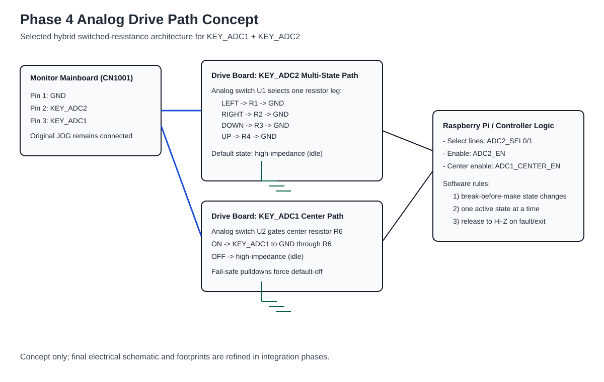

# Phase 4 Execution Record

## Purpose

This document records the execution outcome for `Phase 4: Analog Drive Circuit Design`.

It complements:

- [Implementation Plan](../implementation/plan.md)
- [Solution Overview](../design/solution-overview.md)
- [Phase 2 Execution Record](./phase-2-execution.md)
- [Phase 3 Execution Record](./phase-3-execution.md)
- [Phase 4 Analog Drive BOM](../hardware/phase-4-analog-drive-bom.md)

## Goal

Design and approve an analog drive path that can safely reproduce the required `JOG` resistor-to-ground states on `KEY_ADC1` and `KEY_ADC2` while preserving the original front-panel `JOG` behavior.

## Reference Diagram

Current analog-drive concept diagram:

KiCad design artifacts for implementation:

- KiCad project: [`hardware/kicad/phase-4-analog-drive/phase-4-analog-drive.kicad_pro`](../../hardware/kicad/phase-4-analog-drive/phase-4-analog-drive.kicad_pro)
- KiCad schematic: [`hardware/kicad/phase-4-analog-drive/phase-4-analog-drive.kicad_sch`](../../hardware/kicad/phase-4-analog-drive/phase-4-analog-drive.kicad_sch)
- KiCad PCB: [`hardware/kicad/phase-4-analog-drive/phase-4-analog-drive.kicad_pcb`](../../hardware/kicad/phase-4-analog-drive/phase-4-analog-drive.kicad_pcb)
- KiCad BOM CSV: [`hardware/kicad/phase-4-analog-drive/phase-4-analog-drive.bom.csv`](../../hardware/kicad/phase-4-analog-drive/phase-4-analog-drive.bom.csv)

## Inputs From Prior Phases

The design is based on these already-confirmed constraints:

- `KEY_ADC1` and `KEY_ADC2` are interpreted by the monitor as resistance-to-ground states.
- `KEY_ADC1` is effectively binary (`idle` vs `center`).
- `KEY_ADC2` requires multiple distinct analog states (`idle`, `left`, `right`, `down`, `up`).
- the original `JOG` board remains physically present and must continue to function.
- observation and drive paths must coexist without bus contention.

## Design Scope

In scope:

- analog drive architecture for `KEY_ADC1` and `KEY_ADC2`
- drive/observe coexistence strategy
- preservation strategy for original `JOG` behavior
- component selection for the drive subcircuit
- analog-drive BOM and review artifacts

Out of scope:

- final integrated board outline and connector families
- final software API surface
- final GPIO numbering decisions

## Candidate Drive Approaches

### Candidate A: GPIO-Selected Discrete Resistor Ladder

Use analog switches to connect pre-selected resistor legs to ground per command.

Pros:

- deterministic resistance states
- straightforward debug with DMM
- minimal software complexity

Cons:

- more passives and routing density
- tolerance-stack management across many discrete values

### Candidate B: Digital Potentiometer Per Channel

Use one digital potentiometer channel per driven signal.

Pros:

- compact resistor-state control via software
- fewer discrete resistor networks

Cons:

- wiper behavior and endpoint resistance may reduce state fidelity
- update timing and nonlinearity may complicate repeatability

### Candidate C: Fail-Safe Per-Leg Analog Switch Drive (Selected)

Use one normally-open analog switch per resistor leg so every commanded resistance-to-ground path is individually off by default.

Pros:

- best fit to asymmetric signal behavior (`KEY_ADC2` multi-state, `KEY_ADC1` binary)
- hardware-default safe state does not depend on mux address decoding during Pi boot or reset
- predictable electrical states with low software ambiguity
- preserves a clear path to later calibration refinement

Cons:

- uses more switch-control GPIOs than a mux-based design
- slightly higher part count than a shared-address mux approach

## Selected Architecture

The selected Phase 4 architecture is a **fail-safe per-leg switched-resistance drive path**:

- `KEY_ADC2`: four independent bilateral analog-switch channels gate four calibrated resistor legs to `GND`, one per logical direction.
- `KEY_ADC1`: dedicated single bilateral analog switch gates the center pull-down leg.
- both channels default to high-impedance (`idle`) when no command is active.
- one command arbiter guarantees mutually exclusive drive state application.
- hardware biasing holds all switch enables in the off state until the host actively asserts a command.
- software-enforced break-before-make timing remains in place as a second line of protection.

## Original `JOG` Preservation Strategy

The original front-panel `JOG` remains connected in parallel with the controller board under these rules:

- controller outputs are never actively driven high onto monitor lines.
- controller only presents controlled resistance-to-ground states.
- controller defaults to high-impedance when idle or faulted.
- firmware arbitration blocks controller-driven actions while local physical manipulation is detected as active.

## Drive/Observe Coexistence Strategy

- observation front end remains high-impedance and passive relative to drive operations.
- software continuously verifies observed line values during drive operations.
- if observed voltages fall outside expected windows, drive is immediately released to high-impedance and the sequence is aborted.

## Verification Approach

The Phase 4 verification approach is:

1. bench-check each commanded resistor state at the monitor-side connector with power off.
2. verify powered-state voltages for each commanded logical action.
3. validate that local `JOG` operation still works with the drive board connected.
4. run repeated command cycles while confirming no stuck-active drive condition.
5. confirm safe release-to-idle behavior on host process termination.

## Deliverables Completed

- approved analog drive topology and part families
- analog drive BOM with tested commercial resistor substitutions
- architectural schematic artifact for review, including resistor-direction annotations
- documented verification plan for implementation phase

## Exit-Criteria Assessment

Phase 4 is not fully complete yet.

The design direction, resistor selections, and review artifacts exist, but the KiCad schematic still needs one more cleanup pass before the phase can be considered closed. The remaining gap is the connector-to-IC presentation in the schematic: `J1` and `J2` are partially reworked toward explicit drawn wiring, but the current sheet still needs visual and ERC cleanup before it is ready to sign off as the final Phase 4 schematic.

At this point, the following Phase 4 criteria are satisfied:

- there is a reviewable analog-drive design for reproducing required states
- there is a reviewable BOM and schematic artifact
- integration assumptions and verification strategy are documented for implementation

The following Phase 4 work is still open:

- finish the connector-to-IC routing cleanup in the KiCad schematic
- return ERC to the prior clean baseline for schematic-structure checks
- do one final visual review pass in KiCad before declaring the schematic finished

## Open Items Deferred to Later Phases

- final integrated-board connector and mechanical constraints
- exact software timing constants after hardware-in-loop testing
- JLCPCB production-part finalization beyond the already-tested substitute resistor set
