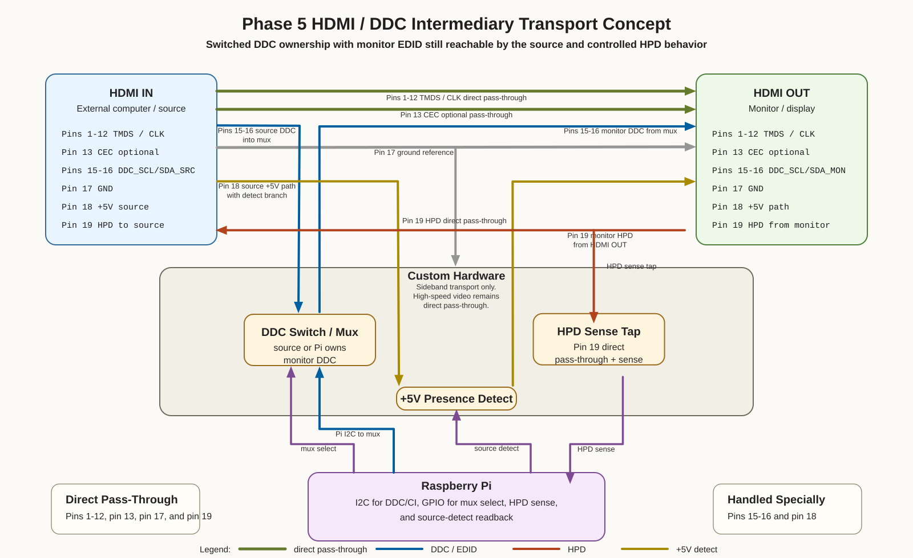

# Phase 5 Execution Record

## Purpose

This document records the execution outcome for `Phase 5: HDMI and DDC Communication Design`.

It complements:

- [Implementation Plan](../implementation/plan.md)
- [Requirements](../requirements.md)
- [Architecture](../architecture.md)
- [Solution Overview](../design/solution-overview.md)
- [CJ791 DDC and VCP Behavior](../ddc/cj791-vcp-behavior.md)
- [Phase 5 HDMI And DDC Transport Design](../hardware/phase-5-hdmi-ddc-transport.md)

## Reference Diagram

Current Phase 5 transport concept diagram:

## Goal

Define and approve how the final system preserves practical use of the monitor's `HDMI` input while still maintaining a reliable `DDC/CI` communication path for the controller.

## Inputs From Earlier Work

The Phase 5 decision is based on these already-established project facts:

- `DDC/CI` is useful on the `CJ791` for readback and selected direct controls
- `DDC/CI` does not replace `JOG` emulation for full monitor control on this unit
- preserving practical `HDMI` input use is a project requirement
- permanently occupying the monitor's `HDMI` path is only acceptable as a temporary development compromise
- the long-term design must avoid sacrificing the monitor's practical `HDMI` input

## Scope

In scope:

- `HDMI` and `DDC` transport direction
- evaluation of how `DDC` can coexist with a normal external `HDMI` source
- interface implications for the later integrated hardware design
- identification of whether extra transport hardware is required beyond the core controller functions

Out of scope:

- final integrated controller board layout
- exact part selection for the transport hardware
- final timing tuning for source-side takeover and release
- full `DDC` capability characterization for every monitor workflow

## Candidate Transport Directions

### Candidate A: Passive Parallel DDC Tap

Attach the Raspberry Pi directly in parallel with the source and monitor on `DDC`.

Decision:

- rejected

Reason:

- too much electrical and protocol ownership risk for a final design

### Candidate B: Switched DDC Ownership

Allow either:

- the external source
- or the Raspberry Pi

to own monitor-side `DDC`, but not both at the same time.

Decision:

- selected

Reason:

- preserves a realistic hardware implementation path
- avoids uncontrolled multi-master sharing
- still allows deliberate Pi-side monitor control and readback

### Candidate D: Attached Pi Listener/Slave Plus Temporary Source Disconnect

Keep the Pi attached to the live `DDC` bus during ordinary source-owned operation in a non-owning listener or slave-capable role, then temporarily disconnect the external source path when the Pi needs its own master transaction.

Decision:

- selected for current Phase 5 exploration

Reason:

- avoids extra GPIOs dedicated only to `SCL` / `SDA` idle observation
- allows logging of live host `DDC` traffic for later learning
- preserves deliberate single-master monitor-side access during Pi transactions
- remains simpler than full monitor emulation

### Candidate C: Full HDMI Proxy Or Bridge

Use active intermediary hardware that behaves like a true `HDMI` bridge or proxy.

Decision:

- rejected for the current project direction

Reason:

- too complex for the current hardware and cost goals

## Selected Direction

The approved Phase 5 direction is:

- attached Pi listener/slave plus temporary source disconnect for Pi-owned transactions
- preserve ordinary source access to monitor `EDID`
- external-source `pin 18` presence sensing
- selectable monitor-side `pin 18` source: external pass-through or Pi-generated `+5V`
- plus careful `HPD` handling

With the current preferred interpretation:

- the Pi remains attached to the live `DDC` bus in a non-owning listener or slave-capable role during normal source-owned operation
- the Pi may observe and log ordinary host `DDC` traffic in that state
- when the Pi needs a monitor transaction, the external source path is temporarily disconnected from monitor-side `DDC` and the Pi acts as master
- source-side `pin 18` is sensed so the controller knows whether an external computer is attached
- monitor-side `pin 18` may be driven from either the external source or a Pi-generated regulated `+5V` rail
- the two `pin 18` sources must remain isolated so they cannot backfeed into each other
- `pin 19` `HPD` is treated as a monitor-to-source signal and defaults to pass-through plus observation
- active `HPD` conditioning or source-presence assist remains optional follow-up hardware, not a Phase 5 assumption

This means the project now assumes a smart sideband intermediary rather than:

- a passive `DDC` tap
- a permanently sacrificed `HDMI` path
- a full active `HDMI` video bridge

## Practical System Model

The selected operating model is:

1. when no external source is attached, the Pi may present monitor-side `pin 18` from a local regulated `+5V` source and own monitor-side `DDC`
2. during ordinary external-source use, the external source normally owns both monitor-side `pin 18` presence and monitor-side `DDC` while the Pi remains attached in a non-owning listener or slave-capable role
3. when the Pi needs a monitor transaction, it temporarily disconnects the external source path from monitor-side `DDC`, performs a short query or command as master, and then restores the source path
4. external-source `pin 18` and Pi-generated `pin 18` must never be directly tied together

Important caveat:

- item 1 is still a validation target rather than a guaranteed fact, because the monitor may or may not treat Pi-generated monitor-side `pin 18` `+5V` as sufficient presence for `HDMI`-side `DDC`

This model assumes:

- short explicit Pi transactions
- no aggressive background Pi polling while a real source is attached
- stable monitor presence toward the external source
- Pi takeover occurs only after the source-owned `DDC` bus appears idle
- the attached Pi listener or slave-capable role remains electrically well behaved on the live bus

## Why `EDID` And `HPD` Matter

The transport decision still treats `EDID` and `HPD` as important design constraints, but not as justification for adding a dedicated `EDID` emulation block in this phase.

Why:

- losing access to monitor `EDID` can trigger display reconfiguration or output re-detection
- unstable `HPD` can make the source think the monitor disconnected
- even if Pi-side `DDC` transactions work electrically, the user experience is still bad if the source keeps re-enumerating the display

So the transport design is not only a `DDC` mux problem. It is a stable-display-presence problem.

## Interface Impact On Later Phases

Phase 5 now implies that the later integrated hardware design must account for:

- source-side `HDMI` transport interface
- monitor-side `HDMI` transport interface
- attached Pi `DDC` interface on the live bus
- source-side `DDC` disconnect control for temporary Pi-owned transactions
- source-side `pin 18` sensing
- Pi-generated local `+5V` for optional monitor-side `pin 18` assertion
- `pin 18` source-selection and isolation hardware
- `HPD` monitoring or control hardware
- a Pi-facing control path for transport ownership logic

This means the final hardware plan may require:

- a separate transport intermediary board
- or an expanded integrated controller board that includes the `HDMI/DDC` sideband path

The exact packaging decision is still deferred.

## PCB Implementation Approach

The current Phase 5 PCB-design approach is:

- manual connector placement
- manual routing of the controlled sideband nets
- direct short pass-through routing for untouched `HDMI` lines
- DRC-driven iterative cleanup
- no dependence on generic autorouters or AI-generated routing as the primary implementation method

Practical board assumptions recorded for this phase:

- `HDMI source` and `HDMI monitor` connectors should sit side by side on the same external edge of the board
- Raspberry Pi control and power connections should sit away from the connector edge
- the board is primarily a sideband-intermediary board, not a full active `HDMI` signal-conditioning board
- the `DDC`, `pin 18`, and `HPD` paths require intentional routing and review
- if 2-layer routing proves too compromised, moving to 4 layers is acceptable

This means the PCB task is treated as explicit electrical layout work, not as a netlist-to-board automation exercise.

## Deliverables Completed

- documented the final-system requirement to preserve practical `HDMI` use
- recorded why passive parallel `DDC` sharing is rejected
- recorded why a full active `HDMI` proxy is rejected for the current project
- approved switched `DDC` ownership as the selected direction
- documented that dedicated `EDID` emulation was descoped for this phase due to extra complexity
- documented the need to preserve ordinary source access to monitor `EDID` plus careful `HPD` handling
- documented external-source `pin 18` sensing and selectable monitor-side `pin 18` source ownership
- recorded attached Pi listener/slave plus temporary source disconnect as the current Phase 5 `DDC` architecture under exploration
- recorded the operating-state model for source-attached and Pi-ownership cases
- recorded the Phase 5 rule that `DDC` takeover is based on explicit ownership switching after observing `SCL` and `SDA` idle, not on Pi-side monitor emulation
- recorded the PCB-design approach as manual placement plus manual routing with DRC-driven cleanup, not generic autorouting
- documented the later interface impact on integrated hardware design

## Exit-Criteria Assessment

Phase 5 is complete at the architectural-direction level.

The project now has:

- an approved `HDMI/DDC` communication direction for the final system
- a documented rationale for the selected direction
- a clear rejection of permanent `HDMI` sacrifice as the final-system assumption
- a defined transport impact on later hardware design phases

## Open Items Deferred To Later Phases

- exact `DDC` switch or mux part selection
- whether the attached Pi listener or slave-capable role is electrically clean enough on the live `DDC` bus
- exact source-disconnect implementation for Pi-owned `DDC` transactions
- exact `HPD` electrical strategy
- exact `pin 18` source-selection implementation
- exact current-limit and backfeed-protection strategy for Pi-generated `+5V`
- whether the monitor answers `HDMI`-side `DDC` when no external source is attached but monitor-side `pin 18` is driven from the Pi-generated `+5V` source
- whether the transport hardware is a separate board or part of the integrated controller board
- real-world disruption testing with a normal external computer attached
- detailed verification plan for takeover timing and recovery behavior
- final fabrication-ready PCB layout for the Phase 5 intermediary board
