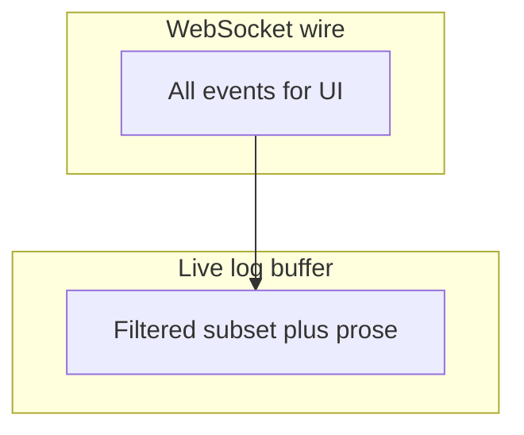

# Bus naming and live log hygiene (consolidated)

This document merges two related tracks: **(A) one canonical name per front-panel net** across API, code, and logs, and **(B) quieter, human-readable live logs** that do not mirror every websocket event. Extend this file with additional todos as needed.

## Overview

- **Naming:** The same three schematic nets (KEY_ADC1, KEY_ADC2, KEY_LED) appear under many aliases (`key_adc1_active`, `adc1`, `KEY_ADC1(center)` in logs, etc.). The REST/WS `SignalSnapshot` today exposes only **two** booleans; KEY_ADC2 is analog-only and not on the wire as a snapshot field.
- **Live log:** One jog hold + release can produce **six** log lines from deck control alone; observation can add more `bus/snapshot` lines. **Target:** `category: bus` for **physical** KEY_ADC1 / KEY_ADC2 / KEY_LED comes **only** from [`ObservationBusService`](../../backend/src/pi_deck/services/observation_bus.py)—not from [`DeckControlService`](../../backend/src/pi_deck/services/deck_control.py) post-`read_signals()` (see **Single source of truth** below).
- **Link between tracks:** Agreeing a **glossary** first makes it easier to use **one line per meaningful change** in [`live_log.py`](../../backend/src/pi_deck/services/live_log.py) without mixing “center”, `key_led`, and `KEY_LED` in the same paragraph.

### Single source of truth (physical keys + LED)

- **Observation-only:** `bus/snapshot` and `bus/led_changed` for real front-panel state should be **emitted only** from bus observation (poll + ALERT, [`observation_bus`](../../backend/src/pi_deck/services/observation_bus.py)).
- **Deck stays command domain:** `command` / `held` / `released` / `pulse` remain from [`deck_control`](../../backend/src/pi_deck/services/deck_control.py) (software jog drive)—not the same as passive key nets.
- **Remove** duplicate `ws_bus_snapshot` from jog hold/release/press after `read_signals()` so the timeline does not mix two sources of truth.
- **Edge cases:** REST `/status` and WS `connected` still need a coherent `signals` snapshot; mock/live parity; possible one-tick delay if UI relied on deck-emitted snapshot—document in implementation.

---

## Hardware reference (three buses)

### `KEY_ADC2` directional channel

| State | Measurement |
| --- | --- |
| `Idle` | `3.3V` to `GND` |
| `Down` | `3.3 kOhm` to `GND` |
| `Right` | `9 kOhm` to `GND` |
| `Up` | `22.6 Ohm` to `GND` |
| `Left` | `32.8 kOhm` to `GND` |

Decoded via ADS1115 / [`key_adc2_decode`](../../backend/src/pi_deck/hardware/key_adc2_decode.py); not in `SignalSnapshot` today.

### `KEY_ADC1` center channel

| State | Measurement |
| --- | --- |
| `Idle` | `3.3V` to `GND` |
| `Center` | `23 Ohm` to `GND` |

Digital observe → `key_adc1_active`.

### `KEY_LED`

0 V vs 3.3 V (off vs on) → `key_led_active`.

---

## Why `signals - KEY_ADC1(center)=… KEY_LED=…` on a *left* press is wrong in the log

After jog hold/release, [`deck_control`](../../backend/src/pi_deck/services/deck_control.py) still emits `bus/snapshot` from `read_signals()`, which only carries **KEY_ADC1 + KEY_LED**. **Direction (left)** lives on **KEY_ADC2** and is already expressed in **`command` hold/release** (`action: left`). The snapshot line does **not** describe KEY_ADC2, yet it appears in the same timeline as a direction event and reads like a global “signals” summary—so it mixes **center + LED** with a gesture that is **neither**, and omits the bus that actually moved. **Plan:** stop logging this bundled line on jog, relabel it as passive GPIO observe, or split narratives; see todo **snapshot-decouple** in the Cursor plan.

---

## Part A — Bus / key signal naming

### Three nets vs two API fields

| Schematic | Role | In `SignalSnapshot` today |
|-----------|------|---------------------------|
| **KEY_ADC1** | Digital GPIO (conditioned), product “center” | `key_adc1_active` |
| **KEY_ADC2** | Analog via ADS1115 AIN0 → direction decode | **Not** in snapshot; see `key_adc2_decode`, `Ads1115`, `observation_bus` |
| **KEY_LED** | Digital GPIO | `key_led_active` |

Naming drift examples: API `key_adc1_active`, pins `key_adc1_digital`, locals `adc1, led`, logs `KEY_ADC1(center)=…` vs `key_led -> on`.

### Policy options (pick one family)

- **Option A — Schematic-first:** KEY_ADC1 / KEY_ADC2 / KEY_LED in prose and logs; keep snake_case JSON (`key_adc1_active`, …) and document equivalence.
- **Option B — Neutral keys (`key_1`, `key_2`, `key_led`):** Breaking for clients unless versioned or aliased.
- **Option C — Product names:** e.g. `center_key`, direction analog, `led`—large rename.

Start with a **one-page glossary** (table: silk → API field → module → log template) in [code-guidelines.md](../development/code-guidelines.md) or here.

### Implementation (when executing)

1. Freeze glossary and log string templates.
2. Backend: rename `SignalSnapshot` / WS `data` keys only with a migration story; else unify comments, `_event_message` strings, and locals first (non-breaking).
3. Frontend: [types.ts](../../frontend/src/types.ts), [useDeckEvents.ts](../../frontend/src/hooks/useDeckEvents.ts), tests.
4. Docs / scripts: [pi_deck_gpio_probe.py](../../scripts/pi_deck_gpio_probe.py), phase docs, [memory/project_overview.md](../../memory/project_overview.md).
5. **KEY_ADC2:** When exposing on the wire, use the same naming family (e.g. `key_adc2_mv` or `key_adc2_direction`), not only `ain0`.

**Risk:** JSON key renames break external clients; prefer glossary + log text first, API bump later.

---

## Part B — Live log verbosity and semantics

### Reference pattern

A single line such as `…  bus  key_led -> on` can be sufficient; redundant `bus/snapshot` lines that only repeat the same LED state add noise.

### Product stance

- Live log messages stay **human prose**; they are not a parallel JSON API for parsers.
- Full `WsEventV1` stream remains on `/ws/events` for UI state; the **buffer** may be a **filtered subset** of what gets `record_event`.

### Cleanup directions

1. Not every `_emit` should append to the live log buffer (broadcast unchanged for clients).
2. Drop or narrow **`control/state`** in the log if `command/*` already tells the story for jog.
3. **LED:** Prefer one canonical narrative (`led_changed`-style); avoid duplicate snapshot-only lines in the same transition window where possible.
4. **Jog:** Prefer **`command` hold/release** as the main story; attach signal context only when it adds information.

### Optional UX

- Richer `source` in log lines (`observation` vs `deck`) or showing `category` in the UI—see Part A glossary.

### Files likely touched

- [`live_log.py`](../../backend/src/pi_deck/services/live_log.py), [`deck_control.py`](../../backend/src/pi_deck/services/deck_control.py), [`observation_bus.py`](../../backend/src/pi_deck/services/observation_bus.py), backend tests.

---

## Combined todo list

Use this as the master checklist (add rows below for your other work).

| ID | Task |
|----|------|
| **glossary** | Add net → API → log template glossary; pick Option A/B/C |
| **log-filter** | Define `LiveLogService` rules: which `category`/`type` still append to buffer |
| **led-dedupe** | One LED narrative; trim redundant snapshot log lines where safe |
| **jog-narrative** | Trim hold/release log noise (target: not six lines per tap unless each adds value) |
| **docs-log-stance** | Document human prose log; live log not a JSON consumer API |
| **log-strings** | Align `_event_message` strings to glossary (can ship before API renames) |
| **api-rename** | Optional: Pydantic + WS + TS field renames with version/migration |
| **key-adc2-wire** | When exposing KEY_ADC2 on API, same naming family as other nets |
| **snapshot-decouple** | Bundled `bus/snapshot` log after jog is misleading (KEY_ADC1+LED vs KEY_ADC2 direction)—fix or drop from live log |
| **observation-only-bus** | Emit `bus/snapshot` + `bus/led_changed` only from `ObservationBusService`; remove deck_control duplicate snapshots; reconcile status + mock |

---

---

## Implemented (execution pass)

- **`deck_control`:** Removed all `ws_bus_snapshot` emissions after jog hold/release/replace and after jog pulse. Jog path no longer publishes physical bus snapshots (single source: observation).
- **`observation_bus`:** Refactored `_observe_signals`; **mock** hardware now runs the same ~25 ms poll loop so `bus/snapshot` and `bus/led_changed` still reach the UI without deck-originated snapshots.
- **`live_log`:** Do not append log lines for `control`/`state` (still broadcast on WS). Snapshot log text prefix `signals -` → `observe ` for KEY_ADC1/KEY_LED lines.
- **Tests:** Comment fix in `test_phase10_api.py` for jog hold websocket assertion.

Remaining from plan: glossary in code-guidelines, optional API field renames, KEY_ADC2 on wire, further LED snapshot dedupe rules.

## Follow-ups (your additions)

_Add bullets or linked issues here._
